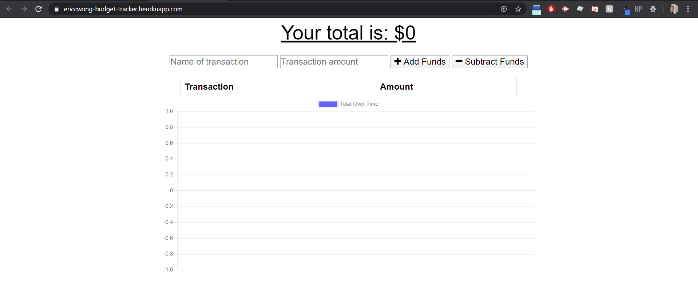
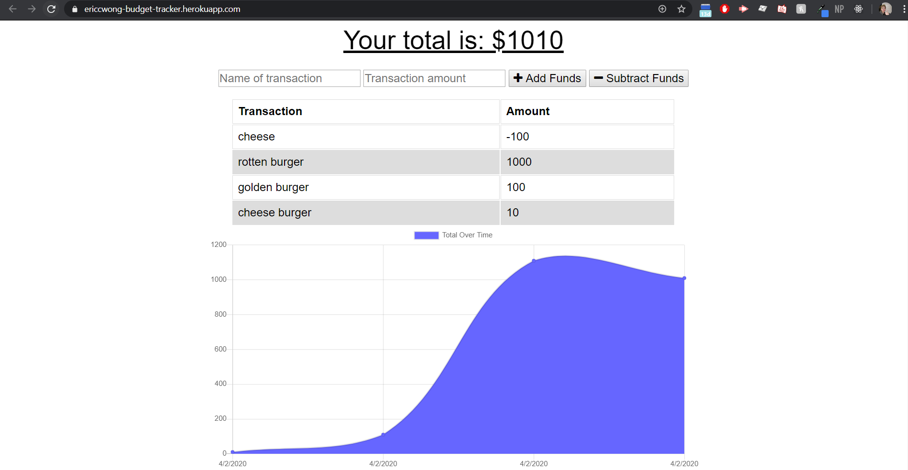
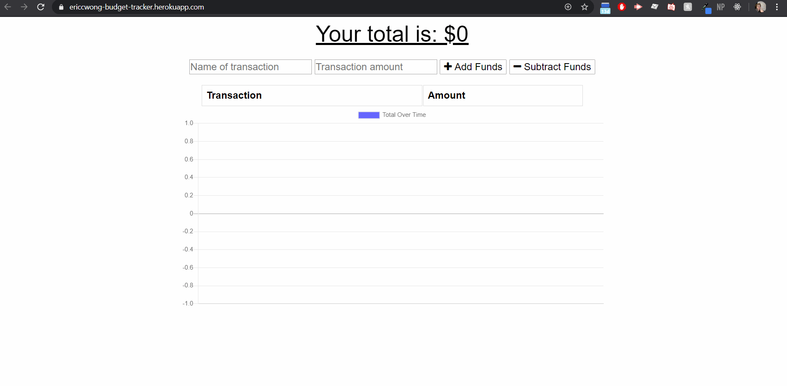

# Budget Tracker

<a href = "https://ericcwong-burger.herokuapp.com/"><strong>Heroku</strong></a> Deployed application. 
<a href = "https://github.com/Ericcwong/burger"><strong>GitHub</strong></a> Repository

# Application display

# Application

Budget Tracker is an application that will help you keep track with your spendings! Depending what you do will affect the chart accordingly. If you add funds the chart will go up and if you subtract funds the chart will go down. The best thing about this tracker is that it will work offline! Meaning if you do not have internet connection, you are still able to add or subtract funds and when you do have internet connection. The cached data will be transfered to the online database!

# Software and technology used
Frontend
<li>HTML5</li>
<li>CSS3</li>
<li>Javascript</li>
Backend
<li>Express</li>
<li>Mongoose</li>
Database
<li>MongoDb</li>
Caching
<li>Service worker</li>
<li>IndexedDB</li>

# Resources

<li>Jonathan Bejarano(Professor)</li>
Jonathan helped guide me and troubleshoot my serviceworker issues. My chrome had an issue with the caching the chart. 
<li>Spencer Bangerter</li>
Spencer helped me troubleshoot the code with Jonathan and with our combined efforts we were able to get this budget tracker to work!

# Usage
 This code is free to use and view
